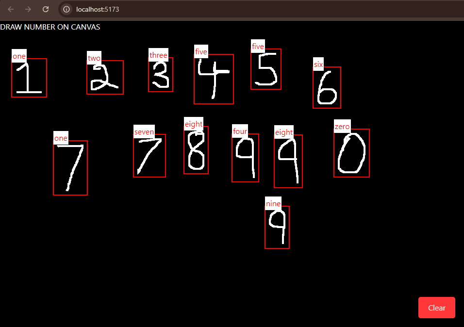

# Handwritten Digit Recognition Web Application

This project is a Handwritten Digit Recognition application built with React and Flask. It allows users to draw digits on a canvas, which are then processed and predicted by a pre-trained TensorFlow model.
## Features

- **Drawing Canvas**: Users can draw digits using the mouse.
- **Real-time Predictions**: Once a digit is drawn, the application sends the image data to the backend for prediction.
- **Display Predictions**: The predicted digit is displayed on the canvas with a bounding box around it.
- **Clear Canvas**: Users can clear the canvas to draw a new digit.

## Technologies Used

- **Frontend**: React.js
- **Backend**: Flask
- **Machine Learning**: TensorFlow (Keras)
- **Image Processing**: PIL (Python Imaging Library)

### Prerequisites

- Node.js
- Python 3.x
- TensorFlow
- Flask
- Flask-CORS
- Keras
- Numpy

## Gallery

